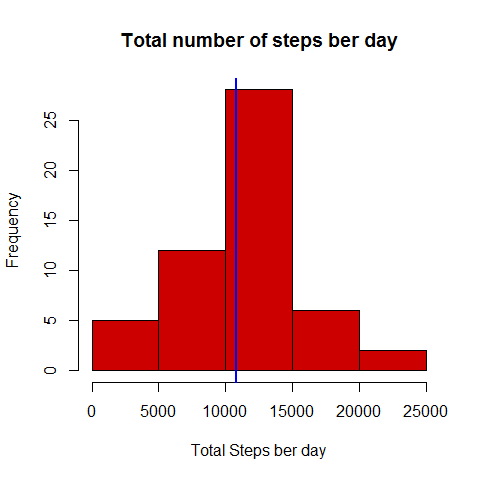
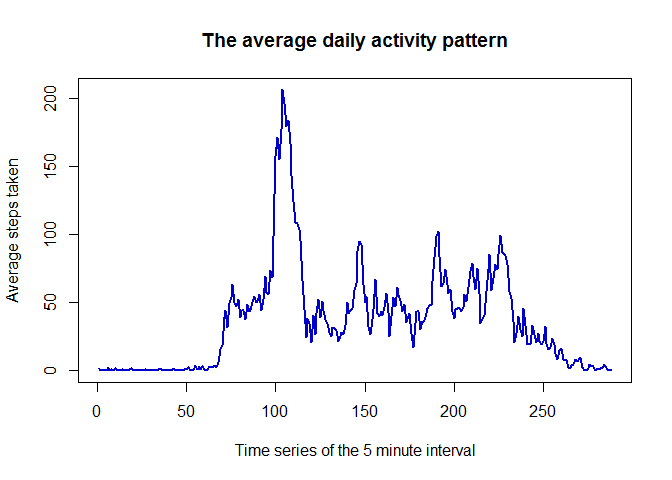
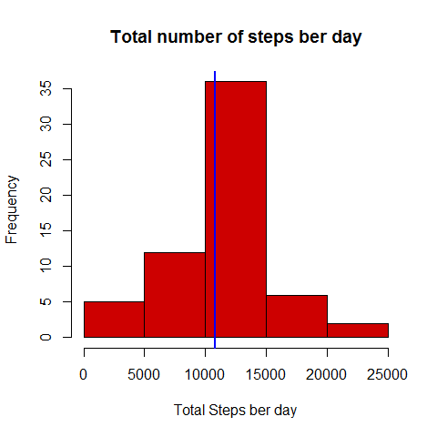
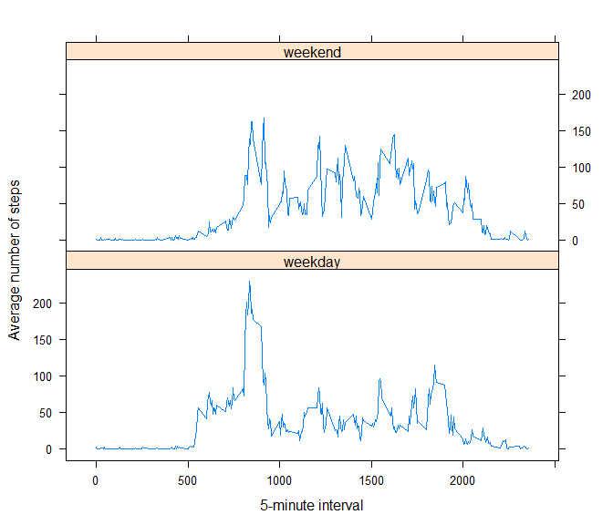

# Reproducible Research Assignment: Course Project 1
UsamaFoad  
**Date: "2016-01-09 23:26:14"**

**Loading library needed for analysis**

```r
# Load lattice library
library(lattice)
```

```
## Warning: package 'lattice' was built under R version 3.2.3
```

**1. Code for reading in the dataset and/or processing the data**


```r
# Working directory path, the data url and file names.
# We will use this values to check if the data exists or not
homedir <- getwd()
data_url <- "https://d396qusza40orc.cloudfront.net/repdata%2Fdata%2Factivity.zip"
csv_file <- "activity.csv"
zip_file <- "repdata_data_activity.zip"
full_csv <- paste(homedir, csv_file, sep = "/")
full_zip <- paste(homedir, zip_file, sep = "/")
```

```r
# Check if the data file (csv) not existed search for the compressed (zip)
# one, if it is not existed too download the data set, or extract (unzip) the
# compressed file if it is existed
if (!file.exists(full_csv)) {
    if (!file.exists(full_zip)) {
        download.file(url = data_url, destfile = full_zip)
    } else {
        unzip(zipfile = full_zip)   }
}
```

```r
# Read the data file and calculate summation
activity <- read.csv(full_csv)
sum_activity <- aggregate(steps ~ date, activity, sum, na.rm =TRUE)
```

**2. Histogram of the total number of steps taken each day**

```r
hist(sum_activity$steps, 
     col="red3",
     main = "Total number of steps ber day",
     xlab = "Total Steps ber day")
abline(v=mean(sum_activity$steps),col="blue", lwd=2)
```

 
----------------
**3. Mean and median number of steps taken each day**  
*missing values are ignored*

```r
cat("The mean of steps taken each day is: ", mean(sum_activity$steps))
```

```
## The mean of steps taken each day is:  10766.19
```

```r
cat("The median of steps taken each day is: ", median(sum_activity$steps))
```

```
## The median of steps taken each day is:  10765
```
----------------
**4. Time series plot of the average number of steps taken**  


```r
timeSeries <- aggregate(steps ~  interval, activity, mean, na.rm =TRUE)

plot(timeSeries$steps, type = "l",  
     col="blue3",  
     main = "The average daily activity pattern",  
     xlab = "Time series of the 5 minute interval",  
     ylab = "Average steps taken",  
     lwd=2)  
```

 

**5. The 5-minute interval that, on average, contains the maximum number of steps**  

```r
cat("The 5-minute interval that, contains the maximum number of steps is: ", timeSeries$interval[timeSeries$steps == max(timeSeries$steps, na.rm = TRUE)])
```

```
## The 5-minute interval that, contains the maximum number of steps is:  835
```

**6. Code to describe and show a strategy for imputing missing data**


```r
activityNew <- activity
cat("Total number of missing values is ", sum(is.na(activityNew)))
```

```
## Total number of missing values is  2304
```

```r
# we will replace NA with the average calculated in "timeSeries"
for (x in 1:length(activityNew$steps)) {
    if (is.na(activityNew$steps[x]) == TRUE) {
        activityNew$steps[x] <-
            timeSeries$steps[timeSeries$interval == activityNew$interval[x]]
    }
}
```

**7. Histogram of the total number of steps taken each day after missing values are imputed**


```r
sum_activityNew <- aggregate(steps ~ date, activityNew, sum)

hist(sum_activityNew$steps, 
     col="red3",
     main = "Total number of steps ber day",
     xlab = "Total Steps ber day")
abline(v=mean(sum_activityNew$steps),col="blue", lwd=2)
```

 


```r
cat("The mean of steps taken each day is: ", mean(sum_activityNew$steps))
```

```
## The mean of steps taken each day is:  10766.19
```

```r
cat("The median of steps taken each day is: ", median(sum_activityNew$steps))
```

```
## The median of steps taken each day is:  10766.19
```
The mean is not differ from the estimates from the first part of the assignment. While the median show very littel increase (< 0.009 %).
In general, the imputing missing data has no effect on mean but has effect on standared deviation.

```r
cat("Standard Deviation BEFORE imputing missing data is: ", sd(activity$steps, na.rm = TRUE))
```

```
## Standard Deviation BEFORE imputing missing data is:  111.9955
```

```r
cat("Standard Deviation AFTER imputing missing data is: ", sd(activityNew$steps))
```

```
## Standard Deviation AFTER imputing missing data is:  105.3248
```

**8. Panel plot comparing the average number of steps taken per 5-minute interval across weekdays and weekends**  


```r
for (x in 1:length(activityNew$date)) {
    if (weekdays(as.Date(activityNew$date[x])) == "Saturday" | weekdays(as.Date(activityNew$date[x])) == "Sunday") {
        activityNew$Weekdays[x] <- "weekend"
        }else 
            activityNew$Weekdays[x] <- "weekday"
}
activityNew$Weekdays <- as.factor(activityNew$Weekdays)

weekdaysORweekends <- aggregate(steps ~ interval + Weekdays, activityNew, mean)

xyplot(steps ~ interval | Weekdays, weekdaysORweekends, type = "l", layout = c(1, 2), 
    xlab = "5-minute interval", ylab = "Average number of steps")
```

 
